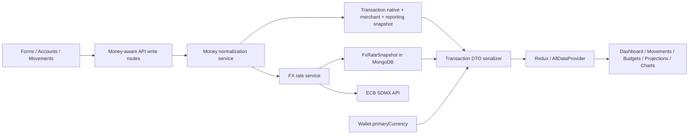

# Gastify Multi-Currency Implementation Plan

> **Status:** In progress, on branch `claude/multicurrency`. Phases 0-8, 9 (Projections transaction-level conversion; Budget-currency math still deferred, see section 16), 10, and 11 (full `--confirm` migration run, complete) are done and pushed. Budgets (section 16, "Budget-domain currency calculations") remains the one deliberately-deferred piece — see Entry #27/#29 in `.mds/AI_COORDINATION_LOG.md` for the explicit user decision and scope boundary.
>
> **Last updated:** 2026-08-25 (by Claude Sonnet 5)
>
> **Initial supported currencies:** MXN, USD, EUR, JPY
>
> **Neutral FX source:** European Central Bank (ECB) reference rates
>
> **Explicitly deferred:** Revolut Business API, Open Banking, webhooks, credentials, and automatic bank synchronization
>
> **Read `.mds/AI_COORDINATION_LOG.md` Entry #26 before touching Phase 8+** — it has the exact file list, the target architecture for the formatter migration (sum in Wallet-primary-currency minor units first, format once), two small pre-existing bugs found along the way, and the standing rule for this branch: full autonomy for code changes, but explicit user permission is required before any write to a real MongoDB document (schema/test/route code changes do not need permission; an actual `Transaction`/`Account`/`Wallet` document write does).

---

## 1. Purpose of this document

This is the authoritative implementation and hand-off plan for adding multi-currency support to Gastify. It exists so another AI assistant or engineer can continue the work without reinterpreting the product decisions, corrupting legacy data, or implementing only a superficial currency selector while leaving financial calculations incorrect.

The feature is not complete when Account and Transaction display a currency code. It is complete only when every stored monetary value has an explicit currency, every aggregate compares compatible values, historical conversions are reproducible, current account valuations disclose their source and date, and import/export/edit/duplicate workflows preserve those guarantees.

Before implementing, every contributor must also read:

- `.mds/AI_COORDINATION_LOG.md`
- The current Git status and active branch
- The mandatory rules at the top of the coordination log

Important repository rules:

1. Do not run `npm run build` unless the user explicitly requests it.
2. Do not commit or push until the user has tested and explicitly approved the local UI.
3. Never use `git add .` or `git add -A`; `.env` is untracked and contains secrets.
4. Restart `next dev` after changing a Mongoose schema; the cached `mongoose.models` registry can otherwise retain the old schema.
5. Do not run a write migration against the user's database without a dry-run report and explicit approval.

---

## 2. Product decisions already approved

These decisions are considered locked unless the user explicitly changes them.

### 2.1 Wallet primary currency

Each Wallet has one user-selectable `primaryCurrency`:

- `MXN`
- `USD`
- `EUR`
- `JPY`

The primary currency controls how Gastify presents portfolio totals, Dashboard totals, reports, Budget summaries, charts, and Projections. It does not rewrite or reinterpret native money.

Example: changing the Wallet from MXN to USD must not turn an existing `10,000 MXN` Budget into `10,000 USD`. The Budget remains denominated in MXN and is converted for display.

### 2.2 Account currency

Each Account has exactly one native currency. A Revolut multi-currency relationship appears as separate Gastify Accounts, optionally grouped by institution:

- Revolut MXN
- Revolut USD
- Revolut EUR
- Revolut JPY

Each Account stores its balance in its own currency. Gastify may show a current equivalent in the Wallet primary currency, but that equivalent is a valuation, not a second bank balance.

### 2.3 Transaction monetary layers

A Transaction may contain:

1. **Account amount:** what actually entered or left the selected Account.
2. **Merchant amount:** what the merchant charged in another currency; optional.
3. **Reporting snapshot:** the historical equivalent used when the transaction was recorded, including rate source and date.

These are embedded fields in the existing Transaction document. They are not separate MongoDB collections.

### 2.4 Simple by default, advanced when needed

The normal form remains simple. Selecting an Account determines the amount currency. Additional merchant/FX fields appear only when the user activates “Charged in another currency” or manually overrides the estimated equivalent.

### 2.5 FX source policy

Source priority for a historical transaction:

1. Exact rate/equivalent supplied by an imported provider operation, such as a future Revolut statement import.
2. Exact equivalent or rate entered by the user.
3. ECB historical reference rate for the transaction date, marked as estimated.

Current Account valuation uses the latest available ECB reference snapshot, regardless of bank. This is intentional: owning USD does not mean the user will exchange them at Revolut's rate.

### 2.6 Transfers and exchanges

Internal transfers and currency exchanges are not income or spending. They create two Transaction ledger legs linked by `transferGroupId`:

- Debit/outgoing leg from the source Account.
- Credit/incoming leg into the destination Account.

Both legs appear in account history but are excluded from Bills, Incomes, Budget consumption, unbudgeted spending, and category reports.

No separate Transfer collection is required for the initial implementation.

### 2.7 Revolut automation remains out of scope

Do not add:

- Revolut Business credentials
- Certificates, JWTs, OAuth flows, refresh tokens
- Revolut webhooks
- Revolut automatic account synchronization
- Open Banking integration

A future connector may reuse the provider-neutral fields in this plan. A dedicated Revolut Excel statement adapter must wait until the user supplies sanitized MXN and USD exports so its column mapping is based on real Mexico statements.

---

## 3. Live FX validation and source rationale

On 2026-08-21, the ECB published:

- `1 EUR = 1.1699 USD`
- `1 EUR = 19.7690 MXN`

The USD/MXN cross rate was:

```text
19.7690 / 1.1699 = 16.898025 MXN per USD
```

Google Finance displayed `16.9128 MXN per USD` at 19:08 UTC. The difference was approximately `0.0874%`. For USD 60,000, the difference between the two valuations was MXN 886.47.

Conclusion: the ECB daily reference is sufficiently close for Gastify portfolio/reporting estimates and is a better production dependency because it provides an official programmatic API. Google does not provide a supported general-purpose Google Finance exchange-rate API for this application; its official capability is a Google Sheets function with delay and extraction limitations.

References:

- ECB rates: https://www.ecb.europa.eu/stats/policy_and_exchange_rates/euro_reference_exchange_rates/html/index.en.html
- ECB API: https://data.ecb.europa.eu/help/api/overview
- ECB API examples: https://data.ecb.europa.eu/help/api/data-examples
- Google Finance USD/MXN: https://www.google.com/finance/quote/USD-MXN?hl=es
- GOOGLEFINANCE limitations: https://support.google.com/docs/answer/3093281?hl=es-419

---

## 4. Non-negotiable financial invariants

Every implementation phase must preserve these invariants.

1. Never add raw numeric amounts from different currencies.
2. A native amount and currency are immutable historical facts unless the user explicitly edits them.
3. Today's FX movement must not change a past Transaction's original historical reporting snapshot.
4. Changing `Wallet.primaryCurrency` changes presentation, not the meaning of stored values.
5. A Budget/IncomeSource/Projection setting retains the currency in which it was created.
6. Internal transfers and exchanges must have zero effect on spending and income totals.
7. Duplicate detection must compare native amount and native currency together.
8. A Transaction assigned to an Account must have an Account amount in that Account's currency.
9. Estimated values must disclose source, effective date, and estimated/stale status.
10. If no safe conversion is available, show the native value and “equivalent unavailable”; never invent a rate or silently treat it as 1.
11. Money must be stored in integer minor units, not binary floating-point amounts.
12. JPY has zero minor decimal places; MXN, USD, and EUR have two.
13. Legacy `amount` fields remain temporarily for compatibility but must not be used by migrated calculations.

---

## 5. Target architecture



Architecture boundaries:

- Shared client/server money primitives must not import Mongoose or secrets.
- ECB fetching and MongoDB caching are server-only.
- UI components consume normalized DTOs and shared formatters; they do not call the ECB directly.
- API routes delegate conversion logic to services rather than duplicating formulas.

---

## 6. Shared currency primitives

### 6.1 New shared currency configuration

Create `src/lib/money/currencies.js`:

```js
export const SUPPORTED_CURRENCIES = ["MXN", "USD", "EUR", "JPY"];

export const CURRENCY_META = {
  MXN: { code: "MXN", minorUnits: 2, locale: "es-MX", label: "Mexican peso" },
  USD: { code: "USD", minorUnits: 2, locale: "en-US", label: "US dollar" },
  EUR: { code: "EUR", minorUnits: 2, locale: "de-DE", label: "Euro" },
  JPY: { code: "JPY", minorUnits: 0, locale: "ja-JP", label: "Japanese yen" },
};
```

Required exported helpers:

- `assertSupportedCurrency(currency)`
- `getMinorUnits(currency)`
- `majorToMinor(value, currency)`
- `minorToMajor(amountMinor, currency)`
- `formatMoneyMinor(amountMinor, currency, options)`
- `formatMoneyMajor(amount, currency, options)` for transitional legacy values only
- `getTransactionNativeMoney(transaction)`
- `getTransactionPrimaryMoney(transaction)`

Use `Intl.NumberFormat`, not implicit locale-only `currency-formatter` calls. UI should normally display the ISO code to avoid ambiguous `$` symbols:

- `MXN $1,250.00`
- `USD $33.00`
- `EUR €20.00`
- `JPY ¥5,000`

### 6.2 Decimal conversion arithmetic

Add `decimal.js` (or a similarly small, audited decimal arithmetic library) rather than using binary floats for rate multiplication. This changes `package.json` and `package-lock.json`.

Create `src/lib/money/conversion.js` with pure functions:

- `crossRate(rates, fromCurrency, toCurrency)`
- `convertMinor({ amountMinor, fromCurrency, toCurrency, rates, roundingMode })`
- `deriveEffectiveRate({ sourceMoney, targetMoney })`
- `percentageDifference(rateA, rateB)`

ECB rates are currency units per EUR. With `EUR = 1`:

```text
rate(from -> to) = rates[to] / rates[from]
```

Round only once, at the final target minor unit, using decimal half-up. Never round intermediate cross rates to two decimals.

### 6.3 Embedded money schemas

Create `src/model/schemas/moneySchemas.js` for reusable embedded Mongoose schemas. These are schemas, not collections.

```js
moneyAmountSchema = {
  amountMinor: Number,   // integer; may be signed only where explicitly documented
  currency: supportedCurrencyEnum,
}

reportingMoneySchema = {
  amountMinor: Number,
  currency: supportedCurrencyEnum,
  rate: Decimal128,     // target currency per one source currency unit
  source: "same_currency" | "legacy_migration" | "manual" |
          "ecb_reference" | "revolut" | "provider_import",
  effectiveDate: Date,
  estimated: Boolean,
  snapshot: ObjectId -> FxRateSnapshot, // optional for exact same-currency values
}
```

---

## 7. MongoDB document changes

All schema changes must be additive first. Do not delete legacy fields in the same release.

### 7.1 Wallet — expand existing document

File: `src/model/Wallet.js`

```js
{
  primaryCurrency: {
    type: String,
    enum: ["MXN", "USD", "EUR", "JPY"],
    default: "MXN",
    required: true,
  },
  currencyUpdatedAt: Date,
  // existing fields remain during migration
}
```

`cash`, `budget.totalBudget`, and `budget.totalSavings` appear to be legacy/dead fields. They must not become new reporting sources. Mark them deprecated in comments, preserve them during this feature, and consider removing them only in a separate cleanup after proving there are no consumers.

### 7.2 Account — expand existing document

File: `src/model/Account.js`

```js
{
  currency: {
    type: String,
    enum: ["MXN", "USD", "EUR", "JPY"],
    default: "MXN",
    required: true,
  },
  balanceMinor: { type: Number, required: true, default: 0 },
  institution: { type: String, default: null },
  balanceUpdatedAt: Date,
  schemaVersion: { type: Number, default: 2 },

  amount: Number, // legacy compatibility only; deprecated
}
```

Indexes:

- Existing user/wallet access pattern remains.
- Optional compound index `{ wallet: 1, currency: 1 }` if query profiling justifies it.

Account rules:

- New Account currency defaults to Wallet primary currency.
- Existing Account currency becomes MXN during migration.
- Account currency cannot be changed when linked Transactions exist in the first implementation. The user must create a correctly denominated Account or run a future explicit migration workflow.
- Account balance may be negative.
- `institution` is display/grouping metadata only; no bank connection is created.

### 7.3 Transaction — expand existing document

File: `src/model/Transaction.js`

```js
{
  kind: {
    type: String,
    enum: ["expense", "income", "transfer", "exchange", "refund", "fee"],
    required: true,
  },
  direction: {
    type: String,
    enum: ["debit", "credit"],
    required: true,
  },
  state: {
    type: String,
    enum: ["pending", "completed", "reverted", "failed"],
    default: "completed",
  },
  money: {
    account: moneyAmountSchema,
    merchant: moneyAmountSchema, // optional
    reporting: reportingMoneySchema,
  },
  transferGroupId: { type: String, default: null },
  transferDirection: { type: String, enum: ["out", "in"], default: null },
  schemaVersion: { type: Number, default: 2 },

  amount: Number,     // legacy compatibility only
  isIncome: Boolean,  // legacy compatibility; derived from kind/direction
  isBill: Boolean,    // legacy compatibility; derived from kind/direction
}
```

Store `money.account.amountMinor` as a non-negative magnitude. Direction is represented by `direction`, not by a negative amount. This matches the existing UI assumption that expense amounts are positive while making transfer legs explicit.

Compatibility mapping:

| New meaning | Legacy flags |
|---|---|
| expense / debit | `isBill: true`, `isIncome: false` |
| income / credit | `isBill: false`, `isIncome: true` |
| transfer/exchange | both false; excluded explicitly by `kind` |
| refund / credit | both false or compatibility income only if required by an old component; new calculations use `kind` |
| fee / debit | compatibility bill true; new calculations use `kind` |

Do not rely on the legacy flags for new reporting logic.

Indexes:

- `{ wallet: 1, date: -1 }`
- `{ account: 1, date: -1 }`
- `{ transferGroupId: 1 }` sparse
- Future provider identifiers are out of scope but schema may reserve a provider metadata object later.

### 7.4 Budget — expand existing document

File: `src/model/Budget.js`

Add embedded money while preserving `goalAmount`/`savingAmount` temporarily:

```js
{
  goalMoney: moneyAmountSchema,
  savingMoney: moneyAmountSchema,
  history: [{
    goalMoney: moneyAmountSchema,
    savingMoney: moneyAmountSchema,
    effectiveFrom: Date,
    effectiveTo: Date,
    // legacy goalAmount/savingAmount remain during transition
  }],
}
```

Rules:

- New Budget currency defaults to Wallet primary currency.
- The first release does not need a prominent independent currency selector; showing the assigned currency read-only is sufficient unless the user requests otherwise during UI review.
- Budget progress is calculated in the Budget's own currency. Each linked/matched Transaction is converted using its historical FX snapshot.
- The result may then be displayed secondarily in Wallet primary currency.
- Project Budget explicit linkage semantics do not change.
- Linked Account savings totals must convert each Account's current balance into the Budget currency before adding.

### 7.5 IncomeSource — expand existing document

File: `src/model/IncomeSource.js`

```js
{
  money: moneyAmountSchema,
  history: [{
    money: moneyAmountSchema,
    recurrence: String,
    effectiveFrom: Date,
    effectiveTo: Date,
  }],
  amount: Number, // legacy
}
```

Future projected occurrences use the latest neutral rate because a future executed rate does not exist. The UI must mark foreign-currency future projections as estimates.

### 7.6 ProjectionSettings — expand existing document

File: `src/model/ProjectionSettings.js`

Replace implicit-number meaning additively:

```js
monthlyBalances: [{
  month: Number,
  money: moneyAmountSchema,
  balance: Number, // legacy during transition
}],
monthlyBuffers: [{
  month: Number,
  expenseMoney: moneyAmountSchema,
  incomeMoney: moneyAmountSchema,
  unexpectedBuffer: Number,       // legacy
  unexpectedIncomeBuffer: Number, // legacy
}],
```

New values default to Wallet primary currency at the time of entry. Changing Wallet primary currency does not reinterpret old manual values.

### 7.7 CategoryRule — expand existing document

File: `src/model/CategoryRule.js`

This model is part of the required scope because `minAmount` and `maxAmount` currently assume MXN.

```js
{
  minAmountMinor: Number,
  maxAmountMinor: Number,
  amountCurrency: {
    type: String,
    enum: ["MXN", "USD", "EUR", "JPY"],
    default: "MXN",
  },
  minAmount: Number, // legacy
  maxAmount: Number, // legacy
}
```

Rules are evaluated against the Transaction amount converted into `amountCurrency`. Existing seeded rules migrate to MXN.

### 7.8 FxRateSnapshot — one new collection

Create `src/model/FxRateSnapshot.js`:

```js
{
  source: { type: String, enum: ["ecb"], required: true },
  baseCurrency: { type: String, default: "EUR", required: true },
  effectiveDate: { type: Date, required: true },
  rates: {
    MXN: Decimal128,
    USD: Decimal128,
    EUR: Decimal128,
    JPY: Decimal128,
  },
  fetchedAt: { type: Date, required: true },
  rawSourceDate: String,
  schemaVersion: { type: Number, default: 1 },
}
```

Unique index:

```js
{ source: 1, baseCurrency: 1, effectiveDate: 1 }
```

Use an upsert for idempotent caching. Do not create one document per Account or one external request per rendered card.

---

## 8. FX rate service

### 8.1 New server-only files

Create:

- `src/lib/money/server/ecbClient.js`
- `src/lib/money/server/fxRateService.js`

`ecbClient.js` responsibilities:

- Build one focused ECB SDMX request for USD, MXN, and JPY against EUR.
- Parse official CSV or JSON/SDMX response safely.
- Validate that EUR, MXN, USD, and JPY are present and positive.
- Return decimal strings; never trust malformed or partial responses.
- Use a bounded timeout via `AbortController`.

Suggested data endpoint shape:

```text
https://data-api.ecb.europa.eu/service/data/EXR/
D.USD+JPY+MXN.EUR.SP00.A
?startPeriod=YYYY-MM-DD
&endPeriod=YYYY-MM-DD
&format=csvdata
```

`fxRateService.js` responsibilities:

- `getLatestSnapshot()`
- `getSnapshotOnOrBefore(date)`
- `getRate({ fromCurrency, toCurrency, date })`
- `convert({ amountMinor, fromCurrency, toCurrency, date })`
- Cache-aside read: Mongo first, ECB only when required.
- Weekend/holiday behavior: use the most recent earlier ECB business date.
- Latest valuation behavior: fetch at most once for the current effective date; reuse Mongo afterward.
- On ECB failure: use the newest cached snapshot and mark the result stale.
- If no cached or remote data exists: return a structured unavailable result; do not use rate 1.

No Vercel Cron is required initially. Cache is warmed on demand. A future cron may pre-warm it but is not necessary for correctness.

### 8.2 New quote API

Create `src/app/api/general-data/fx/quote/route.js`.

Request:

```json
{
  "amountMinor": 3300,
  "fromCurrency": "USD",
  "toCurrency": "MXN",
  "date": "2026-08-21"
}
```

Response:

```json
{
  "ok": true,
  "data": {
    "amountMinor": 55763,
    "currency": "MXN",
    "rate": "16.8980254722",
    "source": "ecb_reference",
    "effectiveDate": "2026-08-21",
    "estimated": true,
    "stale": false
  }
}
```

Validate supported currencies, integer amounts, and reasonable dates. This route receives no bank secrets and performs no external state change.

---

## 9. Transaction normalization and API DTOs

Create `src/lib/money/transactionMoney.js` for pure mapping and `src/lib/money/server/transactionMoneyService.js` for server enrichment.

### 9.1 Write normalization

`buildTransactionMoney()` accepts:

- Account amount and Account currency.
- Optional merchant amount/currency.
- Wallet primary currency.
- Date.
- Optional manual primary equivalent.
- Optional trusted provider equivalent/source.

It returns a complete `money` object and rejects inconsistent input.

Server validations:

- Selected Account belongs to the same user and Wallet.
- Account amount currency equals `Account.currency`.
- Merchant currency may differ.
- Reporting currency equals Wallet primary currency at creation/update time.
- A manual equivalent must be positive and explicitly marked manual.
- Existing Transaction date/currency edits recalculate the estimated snapshot unless the user chooses to preserve an exact manual/provider value.

### 9.2 Read DTO

Persisted reporting data is an audit snapshot. APIs also return a derived `displayMoney` for the Wallet's current primary currency:

```js
displayMoney: {
  native: { amountMinor, currency },
  merchant: { amountMinor, currency } | null,
  primary: {
    amountMinor,
    currency: wallet.primaryCurrency,
    rate,
    source,
    effectiveDate,
    estimated,
    stale,
  },
  historicalReporting: { ...transaction.money.reporting },
}
```

If Wallet primary currency has changed since the Transaction was recorded, derive `displayMoney.primary` from the historical snapshot/reference data without mutating the Transaction.

Provenance rule when the target reporting currency changes:

- An exact manual/provider conversion remains exact only for the currency pair actually stored in `money.account` -> `money.reporting`.
- If the new Wallet primary currency equals the stored reporting currency, reuse that exact snapshot.
- If the user changes the Wallet primary currency to a third currency, derive that new display value from the ECB snapshot on or before the Transaction date and label it `ecb_reference`/estimated. Do not relabel a triangulated value as the exact bank rate.
- The original exact reporting snapshot remains visible in `historicalReporting` for audit.

The same rule applies when converting a Transaction into a Budget currency different from its stored reporting currency: use an exact stored pair only when it directly matches; otherwise use the historical ECB snapshot and disclose that the derived value is estimated.

All new aggregates use `displayMoney.primary.amountMinor` or a domain-currency conversion helper. They do not use `transaction.amount`.

### 9.3 Routes that must use the shared serializer

- `src/app/api/general-data/transactions/get-transactions/route.js`
- `src/app/api/general-data/transactions/get-all/route.js`
- `src/app/api/general-data/transactions/new-transaction/route.js`
- `src/app/api/general-data/transactions/[id]/route.js`
- `src/app/api/general-data/transactions/edit-many/route.js`
- `src/app/api/general-data/transactions/link-budget/route.js`
- `src/app/api/general-data/transactions/speech-add/route.js`
- `src/app/api/general-data/category-rules/suggest/route.js`
- `src/app/api/general-data/category-rules/apply-suggestions/route.js`
- Legacy aggregate endpoints `src/app/api/general-data/route.js` and `src/app/api/general-data/[id]/route.js`

Import, export, and deduplicate routes have their own requirements in Section 15.

---

## 10. Wallet and Account backend

### 10.1 Wallet currency mutation

Modify:

- `src/app/api/general-data/wallet/get-wallet/route.js`
- `src/app/api/general-data/wallet/route.js`
- `src/lib/features/walletSlice.js`
- `src/hooks/getAllInfo/useFetchAndGetAllReduxInfo.js`
- `src/components/Providers/AllDataProvider.jsx`

Prefer a focused endpoint rather than overloading the legacy Wallet route:

- New: `src/app/api/general-data/wallet/update-primary-currency/route.js`

Request must identify the authenticated user and validate Wallet ownership. Response returns the updated Wallet.

After success, client must refresh:

- Wallet
- Accounts/current valuations
- Transactions/displayMoney
- Budgets
- Projections

Changing primary currency must not write to every historical document.

### 10.2 Account CRUD

Modify:

- `src/app/api/general-data/accounts/new-account/route.js`
- `src/app/api/general-data/accounts/update-account/route.js`
- `src/app/api/general-data/accounts/get-account/route.js`
- `src/app/api/general-data/accounts/remove-account/route.js` only if validation/response DTO requires it
- `src/lib/features/accountsSlice.js`

Required behavior:

- Create accepts `balanceMinor` and `currency`.
- Update accepts balance changes; rejects currency changes when Transactions reference the Account.
- Get returns native balance plus `displayBalance` in Wallet primary currency.
- Balance valuation tooltip includes source, effective date, and stale/estimated status.
- Existing ownership gaps must not be copied into new code. Validate user/Wallet ownership server-side.

---

## 11. Wallet and Account frontend

### 11.1 Primary currency selector

Add `src/components/multiUsedComp/PrimaryCurrencySelector.jsx` and mount it in `src/components/multiUsedComp/AccountClient.jsx`.

Placement: Accounts page header/toolbar, near the financial-account context rather than hidden in an unrelated profile setting.

UX:

- Selector options: MXN, USD, EUR, JPY.
- Confirmation modal explains that stored native values will not change, only reports and equivalents.
- After change, refresh all money-aware Redux data.
- Do not pretend the operation exchanged money.

### 11.2 Account create/edit

Modify `src/components/multiUsedComp/EditAccountModal.jsx`:

- Add currency selector during creation.
- Current Balance label includes currency.
- Use shared Gastify inputs/modal styling.
- Currency is read-only when editing an Account with Transactions.
- Show the reason in a tooltip.
- Optionally capture institution name; default blank, with a Revolut-friendly value but no provider integration.

### 11.3 Account cards and account reports

Modify:

- `src/components/multiUsedComp/CreditCard.jsx`
- `src/components/multiUsedComp/MultiCreditCard.jsx`
- `src/components/multiUsedComp/AccountClient.jsx`
- `src/components/multiUsedComp/ResumeTabsTrans.jsx`
- `src/components/multiUsedComp/TabsTrans.jsx`
- `src/components/multiUsedComp/TransactionsResumeCont.jsx`
- `src/components/multiUsedComp/TransResumeChart.jsx`
- `src/components/multiUsedComp/CategoryCirclePacking.jsx`
- `src/components/multiUsedComp/DisplayerCategoryCirclePacking.jsx` if props/labels change

Account card example:

```text
Revolut USD
USD $60,000.00
≈ MXN $1,013,881.53

Reference: ECB · 21 Aug 2026
```

Account-local income/bill totals should use the Account currency. A Wallet/global total uses Wallet primary currency. Do not mix those two contexts.

---

## 12. Transaction creation and editing frontend

Modify all active transaction forms:

- `src/components/multiUsedComp/AddTransactionComp.jsx`
- `src/components/multiUsedComp/EditSingleTransModal.jsx`
- `src/components/multiUsedComp/EditMultipleTransModal.jsx`
- `src/components/multiUsedComp/QuickEditModal.jsx`
- `src/components/multiUsedComp/EditTransModal.jsx` if retained; otherwise prove it is unused and remove in a separate cleanup

### 12.1 Simple form

Default fields:

- Name
- Account Amount
- Account
- Date
- Bill/Income type
- Category/Subcategory
- Tags
- Project

Behavior:

- Select Account first or update Amount label reactively: `Amount (USD)`.
- If no Account, currency defaults to Wallet primary currency and must still be persisted.
- Show a non-editable estimated primary equivalent below the amount when currencies differ.
- Debounce quote requests; do not call on every raw keystroke without delay.

### 12.2 Advanced currency disclosure

Add collapsed option: “Charged in another currency”.

When enabled:

- Merchant amount
- Merchant currency
- Effective bank rate preview when both monetary layers are known
- Neutral ECB comparison
- Optional “Use exact equivalent” manual override

Display whether reporting is exact or estimated.

### 12.3 Editing Account/date/currency

Changing Account to one with a different currency requires an explicit choice:

1. Convert the value and preserve economic value.
2. Keep the number but reinterpret the currency.
3. Enter the new amount manually.

The server must require an explicit strategy; do not infer silently.

Bulk Account changes:

- Safe automatically only when all selected Transactions already share the destination Account currency.
- Otherwise block the bulk action in the first implementation and explain why.
- A future conversion wizard can support mixed-currency bulk reassignment.

---

## 13. Transfers and exchanges

Create a focused API and UI instead of overloading the normal Bill/Income toggle.

New backend:

- `src/app/api/general-data/transactions/transfer/route.js`

New frontend:

- `src/components/multiUsedComp/TransferExchangeModal.jsx`

Request:

```json
{
  "kind": "exchange",
  "sourceAccountId": "...",
  "sourceAmountMinor": 1000000,
  "destinationAccountId": "...",
  "destinationAmountMinor": 59000,
  "date": "2026-08-21",
  "feeMoney": null
}
```

Server behavior:

- Validate both Accounts belong to the same user and Wallet.
- Validate each amount matches its Account currency.
- Require different Accounts.
- Generate one UUID `transferGroupId`.
- Create both Transaction legs inside a MongoDB session/transaction.
- Store exact effective conversion rate derived from the two actual amounts.
- Optionally attach a separate fee Transaction (`kind: fee`) if entered.
- Return both normalized Transactions.

Delete/edit behavior:

- Deleting one transfer leg prompts to delete/revert the entire linked operation.
- Editing a transfer/exchange opens the transfer modal, not the normal expense form.
- `reverted` legs remain auditable but are excluded from totals.

---

## 14. Movements — mandatory UX and correctness scope

Primary file: `src/components/multiUsedComp/Movements.jsx`

Shared row file also affected:

- `src/components/Transactions/ItemList/TransactionItemList.jsx`

Supporting files:

- `src/components/multiUsedComp/DedupPreviewModal.jsx`
- `src/components/multiUsedComp/DeletePreviewRow.jsx`
- `src/components/multiUsedComp/DuplicateComparisonTable.jsx` if monetary cells are rendered there
- `src/components/modals/contents/modalForTopMonthItem/ModalContentTopMonthItem.jsx`
- `src/components/renderTransactionsInModal/RenderTransactionsInModal.jsx`

### 14.1 Row display

Same currency as Wallet primary:

```text
La Comer                         MXN $1,250.00
Groceries · Revolut MXN          21/08/2026
```

Different Account currency:

```text
Hotel Tokio                      USD $33.00
Travel · Revolut USD             ≈ MXN $557.63
                                  21/08/2026
```

When Merchant money or special FX data exists, show a compact `FX` badge/icon. Tooltip or expandable detail contains:

- Merchant amount/currency
- Account amount/currency
- Wallet-primary reported value
- Effective bank/manual rate
- ECB comparison rate
- Source
- Effective date
- Exact/estimated/stale status

Do not render all three layers inline for every row.

### 14.2 Summary bar

Bills and Incomes summary always uses Wallet primary currency and excludes:

- transfer
- exchange
- reverted
- failed
- pending from finalized totals (pending may have a separate informational subtotal later)

Tooltip may show original-currency composition.

### 14.3 Exact amount filter

Add mode:

- `Primary amount` — default
- `Native amount`

Native mode also requires a currency selector. The filter summary must format with the selected currency.

### 14.4 Duplicate detection

Extract repeated duplicate logic into a shared helper, for example:

- New: `src/helpers/transformers/transactionDuplicates.js`

Native duplicate key must include:

- Name
- Date/tolerance
- Native amount minor
- Native currency
- Account when selected by criteria

`100 MXN` and `100 USD` are never duplicates merely because both contain the number 100.

Update both Movements and `ModalContentTopMonthItem.jsx`, which currently duplicate the comparison implementation.

### 14.5 Search and sorting

- Search may include Account currency and Merchant currency codes.
- Sorting by amount must state whether it sorts by Wallet-primary value or native value. Default global sort uses Wallet-primary value.
- Account-specific views may sort by native Account value.

---

## 15. Excel v3, JSON export, upload, and deduplication

Modify:

- `src/app/api/general-data/files/template/[email]/route.js`
- `src/app/api/general-data/files/upload/[id]/route.js`
- `src/app/api/general-data/files/upload/route.js` — audit/remove legacy or bring to v3; do not leave an undocumented second parser
- `src/app/api/general-data/files/export/[email]/route.js`
- `src/app/api/general-data/files/deduplicate/[id]/route.js`
- `src/components/multiUsedComp/ReadFileComp.jsx`
- `src/components/multiUsedComp/Movements.jsx` export copy
- `src/components/multiUsedComp/DedupPreviewModal.jsx`
- `src/components/multiUsedComp/DeletePreviewRow.jsx`

Set template version to `3.0` in one shared constant, not repeated magic strings. Suggested new file:

- `src/lib/files/gastifyTemplate.js`

### 15.1 Proposed columns

| Column | Header | Required | Meaning |
|---|---|---|---|
| A | Date | Yes | Transaction date |
| B | Concept | Yes | Display name |
| C | Account Amount | Yes | Native amount |
| D | Account Currency | Conditional | Required without Account; must match Account when present |
| E | Type | Yes | Bill / Income / Transfer / Exchange / Refund / Fee as supported by flow |
| F | Category | No | Existing behavior |
| G | SubCategory | No | Existing behavior |
| H | Tags | No | Existing behavior |
| I | Account | No | Existing Account name |
| J | Merchant Amount | No | Original merchant amount |
| K | Merchant Currency | Conditional | Required when Merchant Amount exists |
| L | Reporting Amount | No | Exact/manual primary equivalent if known |
| M | Reporting Currency | Conditional | Required when Reporting Amount exists |
| N | FX Source | No | Generic v3 accepts only `manual`; blank means Gastify derives ECB. Provider sources are reserved for trusted dedicated adapters |

### 15.2 Validation rules

- Account currency is authoritative.
- If spreadsheet Account Currency conflicts with resolved Account currency, skip the row and return a precise error.
- Without Account, blank currency defaults to Wallet primary currency only if this behavior is clearly stated in the template note.
- Merchant amount without Merchant currency is invalid.
- Reporting amount without Reporting currency is invalid.
- User-provided reporting amount in the generic Gastify template is stored as exact/manual. The generic route must reject `revolut`/`provider_import`; only a future dedicated, server-controlled provider adapter may assign those trusted sources.
- Blank reporting amount triggers ECB historical derivation.
- Outdated v2.1 templates are rejected with a clear download-v3 message; do not silently mis-map shifted columns.

### 15.3 Export

- Excel export must be re-importable.
- JSON export preserves complete `money`, `kind`, `direction`, `state`, and transfer grouping.
- Never flatten a multi-currency Transaction back into a single ambiguous amount.

### 15.4 Deduplication

Server Excel dedup queries must include native currency and native amount minor. Do not query only legacy `amount`.

### 15.5 Dedicated Revolut statement import

Deferred until real sanitized statement samples exist. Do not guess columns from generic Revolut documentation. When resumed, build a separate adapter into the same normalized Transaction write service; do not force raw Revolut files through the Gastify template parser.

---

## 16. Budgets, unbudgeted spending, and Project Budgets

Backend files:

- `src/app/api/general-data/budget/new/route.js`
- `src/app/api/general-data/budget/update/route.js`
- `src/app/api/general-data/budget/get/route.js`
- `src/app/api/general-data/budget/remove/route.js` only if unlink responses require money DTOs

Helpers:

- `src/helpers/transformers/budgetCoverage.js`
- `src/helpers/transformers/budgetHistory.js`
- `src/helpers/transformers/budgetTypes.js` only if type helpers need transaction-kind awareness

Components:

- `src/components/multiUsedComp/BudgetCont.jsx`
- `src/components/multiUsedComp/Budgets/BudgetsClient.jsx`
- `src/components/multiUsedComp/Budgets/BudgetBarRow.jsx`
- `src/components/multiUsedComp/Budgets/BudgetDetailModal.jsx`
- `src/components/multiUsedComp/Budgets/BudgetEditModal.jsx`
- `src/components/multiUsedComp/Budgets/ProjectBudgetDetailModal.jsx`
- `src/components/multiUsedComp/Budgets/UnbudgetedSpending.jsx`
- `src/components/multiUsedComp/GoalGaugeRange.jsx`
- `src/components/multiUsedComp/GoalSavingsRange.jsx`

Required semantics:

- Recurring Budget matching logic remains category/subcategory based.
- Project progress remains explicit `Transaction.budget` linkage.
- Transaction amounts are converted to Budget currency using historical transaction rates.
- Internal transfer/exchange legs never consume Budgets.
- Unbudgeted spending totals use Wallet primary currency for display, but matching remains independent of currency.
- Savings linked Accounts are converted into the saving Budget currency using current account valuations.
- Budget forms show their stored currency and never reinterpret values when Wallet primary changes.

Do not add Project Budget planning/`ProjectExpense` work from Entry #20 in the same branch. That is a separate feature.

---

## 17. Projections and recurring income

Backend:

- `src/app/api/general-data/income-sources/get/route.js`
- `src/app/api/general-data/income-sources/new/route.js`
- `src/app/api/general-data/income-sources/update/route.js`
- `src/app/api/general-data/income-sources/remove/route.js` if response DTO changes
- `src/app/api/general-data/projections/get/route.js`
- `src/app/api/general-data/projections/update/route.js`

Helpers:

- `src/helpers/transformers/projectionsChange.js`
- `src/helpers/transformers/budgetHistory.js`
- `src/helpers/transformers/transactionsChange.js`

Components:

- `src/components/multiUsedComp/Projections/IncomeSourcesPanel.jsx`
- `src/components/multiUsedComp/Projections/ProjectionMonthDetailModal.jsx`
- `src/components/multiUsedComp/Projections/ProjectionsClient.jsx`
- `src/components/multiUsedComp/Projections/ProjectionsView.jsx`
- `src/components/multiUsedComp/Projections/ProjectionsInfoModal.jsx`

Required semantics:

- Closed months sum real Transactions converted with historical snapshots.
- Current/future Budget values convert from Budget currency.
- Future foreign IncomeSource values use the latest ECB reference and are marked estimated.
- Starting balance converts every non-credit Account from native currency to Wallet primary using the latest reference snapshot.
- Manual balances and buffers retain their stored currencies.
- Keep existing projection period/business logic unchanged except where currency normalization is required.
- Project Budget projection semantics remain deferred.

---

## 18. Category suggestions

Modify:

- `src/model/CategoryRule.js`
- `src/helpers/transformers/categoryRuleMatcher.js`
- `src/app/api/general-data/category-rules/suggest/route.js`
- `scripts/seed_category_rules.js`
- `src/components/multiUsedComp/CategorySuggestions/SuggestionsList.jsx` only if row money display changes

Rules with amount thresholds compare against the Transaction converted to `rule.amountCurrency`. Existing 59 seeded rules are MXN. Name-only rules are unaffected.

Do not compare a USD native amount directly against a legacy MXN threshold.

---

## 19. Dashboard, summaries, charts, and remaining formatters

All global summaries must use Wallet-primary amounts. Confirmed direct money consumers include:

- `src/components/Dashboard.jsx`
- `src/components/multiUsedComp/TopElementsContainer.jsx`
- `src/components/multiUsedComp/Top3.jsx`
- `src/components/multiUsedComp/HistoricalMovementsandCategories/HistoricalMovementsController.jsx`
- `src/components/multiUsedComp/historicalComparativeCategories/HistoricalComparativeCategories.jsx`
- `src/components/multiUsedComp/TabsComponents/tabsMontlyTransactions/TabsTogglerMontlyController.jsx`
- `src/components/multiUsedComp/TabsComponents/tabsMontlyTransactions/propsForColumnChartAntComparative-tabsToggler/propsColTabsToggler.js`
- `src/components/multiUsedComp/chartsComponents/responsiveBarsChartComponent/ResponsiveBarsChartComponent.jsx`
- `src/components/multiUsedComp/top3/atomicTop/AtomicTop.jsx`
- `src/components/multiUsedComp/top3/top-container/TopContainer.jsx`
- `src/components/multiUsedComp/top3/topMonthContainer/TopItemContainer.jsx`
- `src/components/multiUsedComp/top3/topMonthContainer/TopMonthContainer.jsx`
- `src/components/multiUsedComp/top3/topMonthContainer/TopMonthItem.jsx`
- `src/components/modals/contents/modalForTopMonthItem/ModalContentTopMonthItem.jsx`
- `src/components/renderTransactionsInModal/RenderTransactionsInModal.jsx`
- `src/components/toltips/tooltipsForCharts/TooltipForChart.jsx`

Also audit:

- `src/components/multiUsedComp/TransTable.jsx`
- `src/components/multiUsedComp/TransactionsResumeCont.jsx`
- `src/components/multiUsedComp/TransDetailsGrandContainer.jsx`

Migration strategy for formatters:

1. Introduce shared `formatMoneyMinor`.
2. Replace all `usdFormatChanger` calls with explicit currency-aware calls.
3. Replace `currencyFormatter.format(..., { locale: "en-US" })` calls.
4. Replace hard-coded `$` and `.toFixed(2)` displays.
5. Run `rg "usdFormatChanger|currencyFormatter|toFixed\\(2\\)|\\$ " src` and review every remaining match.
6. Remove `currency-formatter` from `package.json` only when no valid consumer remains.

`src/helpers/transformers/transactionsChange.js` must stop defining a misleading `usdFormatChanger`. Aggregate helpers must operate on normalized/reporting minor values.

---

## 20. Redux and provider state

Modify:

- `src/lib/features/walletSlice.js`
- `src/lib/features/accountsSlice.js`
- `src/lib/features/transacctionsSlice.js`
- `src/lib/features/budgetSlice.js` if Budget DTO shape changes
- `src/lib/store.js` if adding an FX slice
- `src/hooks/getAllInfo/useFetchAndGetAllReduxInfo.js`
- `src/hooks/getAllInfo/useGetInfoFromProvider.js`
- `src/components/Providers/AllDataProvider.jsx`

Preferred initial approach:

- API returns normalized Accounts and Transactions with display values.
- Redux stores those DTOs.
- Do not store live bank credentials or external provider state.
- Add an `fxRatesSlice` only if multiple client forms need quote/cache status independently; otherwise keep quote state local and rely on server-normalized DTOs.

After Wallet primary currency changes, invalidate/refetch all derived money DTOs.

---

## 21. Migration plan

Create:

- `scripts/migrate_multicurrency.js`
- `scripts/audit_multicurrency_migration.js`

Both scripts default to dry-run. A write requires an explicit `--confirm` flag and user approval.

### 21.1 Legacy assumptions

Existing Gastify data was entered as final Mexican-peso values. Migrate all legacy monetary values as MXN, rate 1, exact/non-estimated:

- Wallet `primaryCurrency = MXN`
- Account `currency = MXN`
- Account `balanceMinor = round(amount * 100)`
- Transaction Account/Reporting money = legacy amount in MXN
- Transaction kind/direction derived from `isBill`/`isIncome`
- Budget goals/savings/history = MXN
- IncomeSource amount/history = MXN
- Projection balances/buffers = MXN
- CategoryRule thresholds = MXN

Use source `legacy_migration`, rate `1`, and the Transaction date as `effectiveDate`.

### 21.2 Idempotency

- Skip documents already at target `schemaVersion` with complete money fields.
- Never double-multiply minor amounts.
- Produce counts for migrated/skipped/invalid records per collection.
- Log IDs of invalid records without printing secret environment data.

### 21.3 Dry-run audit

For each collection report:

- Document count
- Missing/invalid amounts
- Before/after total in MXN
- Difference; expected zero after decimal rounding policy
- Orphan Account/Wallet references
- Transactions with contradictory `isBill`/`isIncome`
- Budget history entries missing amounts
- CategoryRule min > max

### 21.4 Write safety

- Confirm MongoDB target/environment before writes without printing credentials.
- Create a recoverable export/backup of affected fields before migration if operating on production data.
- Process in bounded batches.
- Do not delete legacy fields.
- Re-run audit after migration and compare counts/totals.
- Restart dev server after schema changes.

### 21.5 Legacy removal

Removal of `amount`, `goalAmount`, `savingAmount`, old Projection numeric fields, and `currency-formatter` is a later cleanup release after:

- All writes populate new fields.
- All reads use normalized fields.
- Production data audit shows 100% migration.
- User has tested the deployed preview.

---

## 22. Implementation phases and gates

Do not implement everything as one unreviewable commit.

### Phase 0 — Isolation and baseline

- Create branch `codex/multicurrency` in an isolated worktree.
- Confirm current `develop`/`main` state and preserve unrelated/untracked files.
- Record baseline counts and current totals read-only.
- Do not stage `.env`, `.claude/`, or `Gastify.code-workspace`.

Gate: clean isolated worktree and documented baseline.

### Phase 1 — Money primitives and tests

- Currency metadata/minor units/formatters.
- Decimal conversion/cross-rate helpers.
- Embedded money schemas.
- Unit tests for MXN/USD/EUR/JPY and rounding.

Gate: pure tests pass; no application behavior changed.

### Phase 2 — FX cache/service

- `FxRateSnapshot` model.
- ECB client and cache-aside service.
- Quote route.
- Tests with fixed ECB fixtures, weekend fallback, network failure, stale cache.

Gate: quote route produces the verified cross-rate formula and never fetches per render.

### Phase 3 — Additive schemas and migration dry-run

- Expand Wallet, Account, Transaction, Budget, IncomeSource, ProjectionSettings, CategoryRule.
- Add schemaVersion/defaults/fallback reads.
- Build migration and audit scripts.
- Run dry-run only.

Gate: user reviews dry-run report before any database write.

### Phase 4 — Wallet and Accounts

- Primary currency mutation/selector.
- Account currency/balance CRUD.
- Account current-equivalent cards/tooltips.
- Currency-change restrictions.

Gate: user tests Accounts UI with one Account in each supported currency.

### Phase 5 — Transaction writes and editing

- Shared write normalization.
- New/edit/speech/bulk paths.
- Simple/advanced transaction form.
- Manual/ECB source behavior.
- Account reassignment safeguards.

Gate: manual transaction test matrix passes before moving reports.

### Phase 6 — Transaction reads and Movements

- DTO serializer.
- Redux/provider refresh.
- Native/primary/merchant display.
- Summary totals, filters, sorting, duplicates, delete/edit rows.

Gate: user tests Movements on desktop and mobile with mixed currencies.

### Phase 7 — Transfers and exchanges

- Two-leg atomic endpoint.
- Transfer/exchange modal.
- Grouped edit/delete/revert behavior.
- Exclusion from income/spending.

Gate: source/destination histories reconcile and global net impact is zero.

### Phase 8 — Budgets, Dashboard, charts, CategoryRules

- Convert every raw aggregate.
- Budget-domain currency calculations.
- Unbudgeted/Project views.
- Dashboard/top/charts/tooltips.
- CategoryRule threshold currency.

Gate: no mixed raw amount sums remain in an `rg` audit.

### Phase 9 — Projections and IncomeSources

- Money-aware recurring income/settings.
- Historical actual conversions.
- Current Account valuation starting balance.
- Future estimate disclosure.

Gate: closed months remain historically reproducible; current/future totals use Wallet primary currency.

### Phase 10 — Excel v3 and export/dedup

- Versioned template/import/export.
- New columns and validation.
- Currency-aware dedup.
- ReadFile documentation.

Gate: export → re-import round trip preserves all money fields.

### Phase 11 — Migration write and cleanup validation

- Only after explicit approval: production-data migration write.
- Post-migration audit.
- Preview deployment and full user regression.
- Do not remove legacy fields yet.

Gate: user explicitly approves commits/push after local validation.

---

## 23. Test strategy

Money code requires automated tests. Add a small test runner if necessary; Vitest is acceptable and should be documented in `package.json`. Do not rely solely on clicking the UI.

### 23.1 Unit tests

Create tests for:

- Major/minor conversion for all four currencies.
- JPY zero-decimal behavior.
- Negative Account balances.
- Cross rate formula: MXN/USD through EUR.
- Decimal rounding at half-unit boundaries.
- Same-currency rate 1.
- Manual/provider rate priority over ECB.
- Historical snapshot immutability.
- Primary-currency display conversion.
- Budget-domain conversion.
- Duplicate comparison currency awareness.
- Transfer/exchange exclusion predicates.

### 23.2 FX service tests

- Parse official fixture.
- Missing currency fails safely.
- Weekend uses previous business day.
- Cache hit avoids network.
- Remote failure uses cached snapshot and returns stale true.
- No remote/cache returns unavailable, not 1.

### 23.3 API integration tests

- Create MXN Transaction in MXN Wallet.
- Create USD Transaction in MXN Wallet with ECB estimate.
- Create JPY merchant amount paid by USD Account.
- Manual reporting override.
- Reject Account/currency mismatch.
- Change primary currency and verify native Transaction unchanged.
- Create atomic exchange and verify two legs.
- Reject cross-user Account IDs.
- Excel v3 valid/invalid/conflicting currency rows.

### 23.4 UI test matrix

Wallet primary currency each of MXN/USD/EUR/JPY:

- Account cards.
- Add/edit Transaction.
- Movements rows and FX detail.
- Bills/Incomes totals.
- Exact amount filters.
- Duplicate detection.
- Budget progress.
- Unbudgeted spending.
- Project Budget detail.
- Dashboard totals/charts.
- Projections.
- Excel export/re-import.

Test mobile widths because transaction rows already carry dense metadata.

### 23.5 Regression checks

- Existing all-MXN behavior must remain visually and mathematically unchanged except explicit `MXN` labels.
- Project Budget linking remains intact.
- Category suggestions still work.
- Excel category/subcategory/account resolution remains intact.
- Date-range and projection historical-period behavior remains intact.
- No new Mongoose `MissingSchemaError` on Vercel cold starts: every route that populates a model must import it directly.

---

## 24. Acceptance criteria

The feature is accepted only when all statements below are true.

### Data

- Every Wallet has a valid primary currency.
- Every Account has a valid currency and integer balanceMinor.
- Every Transaction has native Account money and a historical reporting snapshot.
- Every Budget/IncomeSource/Projection/CategoryRule monetary value has explicit currency semantics.
- Legacy records are migrated idempotently to MXN with zero unexplained total difference.

### Accounts

- User can create Accounts in MXN/USD/EUR/JPY.
- Account card displays native balance and current Wallet-primary equivalent.
- Tooltip identifies ECB, effective date, and estimate/stale state.
- Currency cannot be silently changed on a populated Account.

### Transactions

- Simple entry remains simple.
- Foreign Account Transaction displays an estimated primary equivalent.
- Optional merchant currency details are preserved and editable.
- Manual/provider exact rates override ECB and remain auditable.
- Changing Wallet primary currency does not mutate native/history data.

### Transfers

- Exchange creates exactly two linked legs.
- No transfer/exchange value appears in Bills, Incomes, Budgets, or unbudgeted spending.
- Linked edit/delete behavior cannot leave one orphan leg.

### Movements

- Rows show native amount and primary equivalent when different.
- FX detail is available without overcrowding every row.
- Summary totals use Wallet primary currency.
- Filters/sorting explicitly choose primary vs native semantics.
- Duplicate detection includes currency.

### Reports

- Dashboard, charts, Budgets, CategoryRules, and Projections never sum incompatible raw amounts.
- Historical Transactions use historical snapshots.
- Current Account valuation uses latest reference snapshot.
- Future foreign projections disclose estimation.

### Files

- Excel v3 imports/exports currencies and optional merchant/reporting data.
- v2.1 is rejected clearly.
- Export/re-import is lossless for supported fields.

---

## 25. Error handling and disclosure language

Use consistent user-facing labels:

- `Estimated using ECB reference rate`
- `Exact rate entered manually`
- `Exact rate provided by Revolut` only when actual imported/provider data exists
- `Last available reference rate: <date>` for weekends/holidays
- `Exchange-rate estimate unavailable` when no safe rate exists

Never label an ECB value as a bank's executable rate.

Do not show raw stack traces or Decimal128 serialization details in UI errors.

---

## 26. Security and ownership

Although bank automation is deferred, currency changes touch valuable financial data.

- Validate session/user ownership on every new mutation route.
- Do not trust client-supplied user/wallet/account relationships.
- Validate that Budget/Account/Transaction references share the same user and Wallet.
- Do not expose `.env`, MongoDB URI, or external responses containing internal diagnostics.
- Rate API accepts only supported currencies, bounded integer amounts, and safe dates.
- Do not store Google/Revolut credentials because none are needed in this scope.

---

## 27. Observability

Server logs should record structured, non-sensitive events:

- FX cache hit/miss
- ECB fetch success/failure and effective date
- Stale fallback use
- Transaction conversion source counts
- Migration batch counts and validation failures

Do not log full Transaction objects, user emails unnecessarily, tokens, or database connection strings.

Optional future metrics:

- Percentage of foreign Transactions using manual vs ECB vs provider rates.
- Stale-rate fallback frequency.
- Currency distribution by Account and Transaction.

---

## 28. Explicit non-goals

Do not expand this branch into:

- Revolut Business API or personal-account scraping
- Any bank OAuth/Open Banking connection
- WhatsApp/Telegram notifications
- ProjectExpense/prospective Project planning
- Cryptocurrency
- Stock/portfolio price tracking
- Tax/accounting-grade realized FX gains and losses
- More currencies than MXN/USD/EUR/JPY
- Automatic Account balance mutation from every manual Transaction unless separately approved
- Deleting legacy money fields in the first release
- A guessed Revolut statement importer without real samples

---

## 29. Risks and mitigations

| Risk | Mitigation |
|---|---|
| Raw mixed-currency sums remain in obscure components | Mandatory `rg` audit and direct-money file inventory in this plan |
| Wallet currency change reinterprets old values | Currency stored on every monetary document; derived display DTO |
| Float rounding errors | Integer minor units + decimal arithmetic |
| JPY formatted with fake decimals | Currency metadata minorUnits = 0 |
| ECB unavailable | Mongo cache; stale disclosure; never fake rate 1 |
| Weekend has no same-day ECB rate | Most recent earlier business snapshot with date shown |
| Account reassignment corrupts currency | Explicit conversion strategy; block unsafe bulk changes |
| Transfers counted as spending/income | `kind`/`direction` predicates and two-leg tests |
| Duplicate tool deletes 100 USD as duplicate of 100 MXN | Native currency included in duplicate key |
| Vercel cold-start populate failure | Each route directly imports every populated Mongoose model |
| Mongoose dev cache hides new fields | Restart local dev after schema changes |
| Migration damages production data | Dry-run default, backup, explicit approval, idempotency, post-audit |
| Concurrent AI stages unrelated work | Isolated worktree and explicit-path staging only |

---

## 30. File inventory

This inventory is based on the repository audit performed 2026-08-21. Before final implementation, rerun searches because concurrent work may add new consumers.

### New planned files

- `src/model/FxRateSnapshot.js`
- `src/model/schemas/moneySchemas.js`
- `src/lib/money/currencies.js`
- `src/lib/money/conversion.js`
- `src/lib/money/transactionMoney.js`
- `src/lib/money/server/ecbClient.js`
- `src/lib/money/server/fxRateService.js`
- `src/lib/money/server/transactionMoneyService.js`
- `src/lib/files/gastifyTemplate.js`
- `src/helpers/transformers/transactionDuplicates.js`
- `src/app/api/general-data/fx/quote/route.js`
- `src/app/api/general-data/wallet/update-primary-currency/route.js`
- `src/app/api/general-data/transactions/transfer/route.js`
- `src/components/multiUsedComp/PrimaryCurrencySelector.jsx`
- `src/components/multiUsedComp/TransferExchangeModal.jsx`
- `scripts/migrate_multicurrency.js`
- `scripts/audit_multicurrency_migration.js`
- Money/FX test files selected by the implementation's test runner

### Existing model/config/dependency files

- `src/model/Wallet.js`
- `src/model/Account.js`
- `src/model/Transaction.js`
- `src/model/Budget.js`
- `src/model/IncomeSource.js`
- `src/model/ProjectionSettings.js`
- `src/model/CategoryRule.js`
- `package.json`
- `package-lock.json`

### Existing backend/API files

- `src/app/api/register/route.js`
- `src/app/api/general-data/route.js`
- `src/app/api/general-data/[id]/route.js`
- `src/app/api/general-data/wallet/get-wallet/route.js`
- `src/app/api/general-data/wallet/route.js`
- `src/app/api/general-data/accounts/get-account/route.js`
- `src/app/api/general-data/accounts/new-account/route.js`
- `src/app/api/general-data/accounts/update-account/route.js`
- `src/app/api/general-data/accounts/remove-account/route.js`
- `src/app/api/general-data/transactions/get-transactions/route.js`
- `src/app/api/general-data/transactions/get-all/route.js`
- `src/app/api/general-data/transactions/new-transaction/route.js`
- `src/app/api/general-data/transactions/[id]/route.js`
- `src/app/api/general-data/transactions/edit-many/route.js`
- `src/app/api/general-data/transactions/link-budget/route.js`
- `src/app/api/general-data/transactions/speech-add/route.js`
- `src/app/api/general-data/transactions/remove-many/route.js`
- `src/app/api/general-data/transactions/remove-transaction/[id]/route.js`
- `src/app/api/general-data/budget/get/route.js`
- `src/app/api/general-data/budget/new/route.js`
- `src/app/api/general-data/budget/update/route.js`
- `src/app/api/general-data/budget/remove/route.js`
- `src/app/api/general-data/income-sources/get/route.js`
- `src/app/api/general-data/income-sources/new/route.js`
- `src/app/api/general-data/income-sources/update/route.js`
- `src/app/api/general-data/income-sources/remove/route.js`
- `src/app/api/general-data/projections/get/route.js`
- `src/app/api/general-data/projections/update/route.js`
- `src/app/api/general-data/category-rules/suggest/route.js`
- `src/app/api/general-data/category-rules/apply-suggestions/route.js`
- `src/app/api/general-data/files/template/[email]/route.js`
- `src/app/api/general-data/files/upload/[id]/route.js`
- `src/app/api/general-data/files/upload/route.js`
- `src/app/api/general-data/files/export/[email]/route.js`
- `src/app/api/general-data/files/deduplicate/[id]/route.js`

### Existing helpers/state/provider files

- `src/helpers/transformers/transactionsChange.js`
- `src/helpers/transformers/projectionsChange.js`
- `src/helpers/transformers/budgetCoverage.js`
- `src/helpers/transformers/budgetHistory.js`
- `src/helpers/transformers/categoryRuleMatcher.js`
- `src/lib/features/walletSlice.js`
- `src/lib/features/accountsSlice.js`
- `src/lib/features/transacctionsSlice.js`
- `src/lib/features/budgetSlice.js`
- `src/lib/store.js`
- `src/hooks/getAllInfo/useFetchAndGetAllReduxInfo.js`
- `src/hooks/getAllInfo/useGetInfoFromProvider.js`
- `src/components/Providers/AllDataProvider.jsx`
- `scripts/seed_category_rules.js`

### Existing Account/Transaction frontend files

- `src/components/multiUsedComp/AccountClient.jsx`
- `src/components/multiUsedComp/MultiCreditCard.jsx`
- `src/components/multiUsedComp/CreditCard.jsx`
- `src/components/multiUsedComp/EditAccountModal.jsx`
- `src/components/multiUsedComp/AddTransactionComp.jsx`
- `src/components/multiUsedComp/EditSingleTransModal.jsx`
- `src/components/multiUsedComp/EditMultipleTransModal.jsx`
- `src/components/multiUsedComp/QuickEditModal.jsx`
- `src/components/multiUsedComp/EditTransModal.jsx`
- `src/components/multiUsedComp/Movements.jsx`
- `src/components/Transactions/ItemList/TransactionItemList.jsx`
- `src/components/multiUsedComp/DedupPreviewModal.jsx`
- `src/components/multiUsedComp/DeletePreviewRow.jsx`
- `src/components/multiUsedComp/DuplicateComparisonTable.jsx`
- `src/components/multiUsedComp/ReadFileComp.jsx`
- `src/components/modals/contents/modalForTopMonthItem/ModalContentTopMonthItem.jsx`
- `src/components/renderTransactionsInModal/RenderTransactionsInModal.jsx`

### Existing Budget/Projection frontend files

- `src/components/multiUsedComp/BudgetCont.jsx`
- `src/components/multiUsedComp/Budgets/BudgetsClient.jsx`
- `src/components/multiUsedComp/Budgets/BudgetBarRow.jsx`
- `src/components/multiUsedComp/Budgets/BudgetDetailModal.jsx`
- `src/components/multiUsedComp/Budgets/BudgetEditModal.jsx`
- `src/components/multiUsedComp/Budgets/ProjectBudgetDetailModal.jsx`
- `src/components/multiUsedComp/Budgets/UnbudgetedSpending.jsx`
- `src/components/multiUsedComp/GoalGaugeRange.jsx`
- `src/components/multiUsedComp/GoalSavingsRange.jsx`
- `src/components/multiUsedComp/Projections/IncomeSourcesPanel.jsx`
- `src/components/multiUsedComp/Projections/ProjectionMonthDetailModal.jsx`
- `src/components/multiUsedComp/Projections/ProjectionsClient.jsx`
- `src/components/multiUsedComp/Projections/ProjectionsView.jsx`
- `src/components/multiUsedComp/Projections/ProjectionsInfoModal.jsx`

### Existing Dashboard/chart/summary frontend files

- `src/components/Dashboard.jsx`
- `src/components/multiUsedComp/ResumeTabsTrans.jsx`
- `src/components/multiUsedComp/TabsTrans.jsx`
- `src/components/multiUsedComp/TransactionsResumeCont.jsx`
- `src/components/multiUsedComp/TransResumeChart.jsx`
- `src/components/multiUsedComp/CategoryCirclePacking.jsx`
- `src/components/multiUsedComp/DisplayerCategoryCirclePacking.jsx`
- `src/components/multiUsedComp/TopElementsContainer.jsx`
- `src/components/multiUsedComp/Top3.jsx`
- `src/components/multiUsedComp/HistoricalMovementsandCategories/HistoricalMovementsController.jsx`
- `src/components/multiUsedComp/historicalComparativeCategories/HistoricalComparativeCategories.jsx`
- `src/components/multiUsedComp/TabsComponents/tabsMontlyTransactions/TabsTogglerMontlyController.jsx`
- `src/components/multiUsedComp/TabsComponents/tabsMontlyTransactions/propsForColumnChartAntComparative-tabsToggler/propsColTabsToggler.js`
- `src/components/multiUsedComp/chartsComponents/responsiveBarsChartComponent/ResponsiveBarsChartComponent.jsx`
- `src/components/multiUsedComp/top3/atomicTop/AtomicTop.jsx`
- `src/components/multiUsedComp/top3/top-container/TopContainer.jsx`
- `src/components/multiUsedComp/top3/topMonthContainer/TopItemContainer.jsx`
- `src/components/multiUsedComp/top3/topMonthContainer/TopMonthContainer.jsx`
- `src/components/multiUsedComp/top3/topMonthContainer/TopMonthItem.jsx`
- `src/components/toltips/tooltipsForCharts/TooltipForChart.jsx`

Some listed files may only need a formatter/prop change. They remain listed because leaving one raw `amount` aggregation behind can invalidate the whole feature.

---

## 31. Final hand-off checklist for another AI/engineer

Before changing code:

- [ ] Read this entire document.
- [ ] Read `.mds/AI_COORDINATION_LOG.md` current state and latest entries.
- [ ] Run `git status --short --branch`.
- [ ] Confirm no other agent is modifying the same shared worktree.
- [ ] Create isolated `codex/multicurrency` worktree/branch only after user authorization.
- [ ] Do not touch Revolut automation.

Before each phase:

- [ ] Re-run relevant `rg` searches for new monetary consumers.
- [ ] Keep schema changes additive.
- [ ] Restart dev server after Mongoose schema edits.
- [ ] Add/adjust unit tests before migrating consumers.
- [ ] Update the coordination log.

Before any DB write:

- [ ] Dry-run migration.
- [ ] Show counts/totals/differences to user.
- [ ] Confirm target environment without exposing secrets.
- [ ] Obtain explicit approval.
- [ ] Ensure recovery/backup path.

Before commit/push:

- [ ] User has tested the local UI.
- [ ] All-MXN regression passes.
- [ ] Mixed-currency matrix passes.
- [ ] No raw mixed-currency sums remain.
- [ ] No `usdFormatChanger`/implicit currency formatter remains in active money UI.
- [ ] Stage explicit files only.
- [ ] User explicitly approves commit/push.

---

## 32. Definition of done

The multi-currency project is done when Gastify can safely hold MXN, USD, EUR, and JPY Accounts; show neutral current Account valuations; record simple and cross-currency Transactions; preserve historical/executed FX provenance; represent internal transfers/exchanges without fake income/spending; display all Movements and reports in the user-selected Wallet primary currency; and import/export the same data without loss or ambiguity.

It is not done if any global total still adds `transaction.amount` or `account.amount` without explicit currency normalization.
